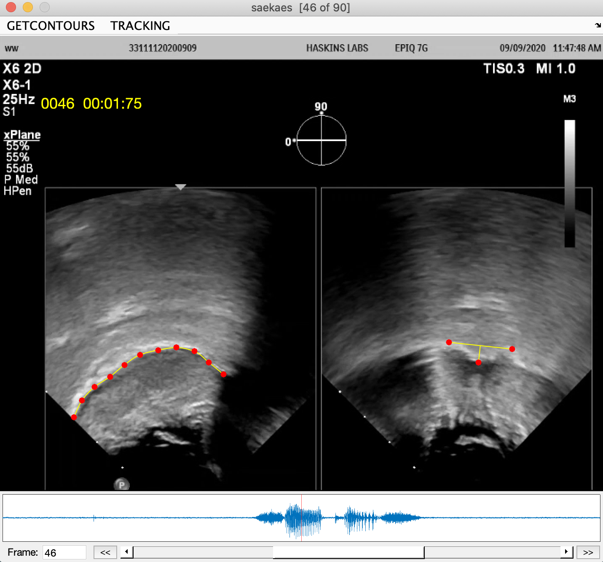
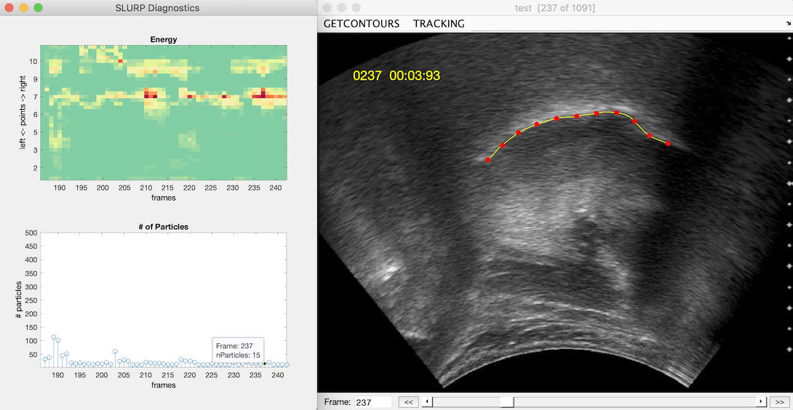
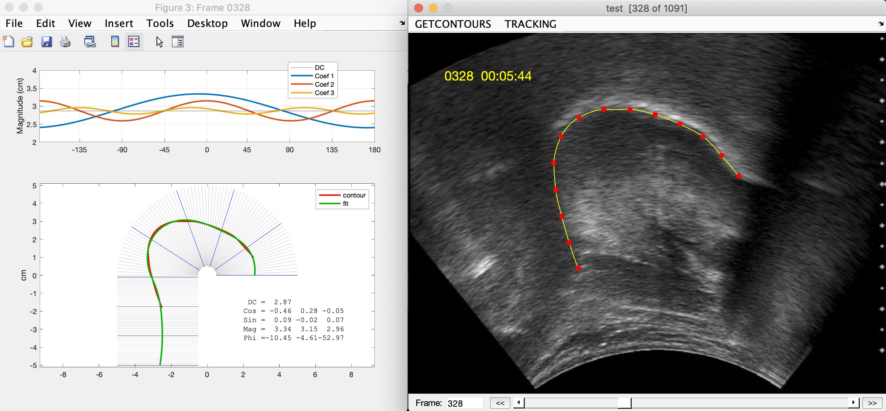

GetContours  
==

Example showing gct_Tahltan plugin applied to Xplane (simultaneous midsagittal and coronal) image of /ae/.  Red dots are interactively adjustable spline anchor points controlling tongue contour fit at right, and defining medial groove depth at right.

**GetContours** is a Matlab-based platform that provides straightforward click-and-drag positioning of reference points controlling a cubic spline fit to a displayed ultrasound image of the midsagittal tongue surface. This fit – the “contour” – provides a discretized representation of the tongue suitable for subsequent analysis. Contour fitting may be either interactive, driven by image forces, or automated through sequences. Features of the program include:

* support for loading from and navigating within DICOM sequence and movie formats

* tools for image filtering, averaging, and contrast enhancement

* **Praat TextGrids** labeled on associated audio can be imported to identify and
annotate articulatory events of interest, allowing rapid selection of key frames within image sequences

* audio from the source movie is displayed if available and may be played to provide context for the displayed frame; clicking on the audio plot may also be used to set the active frame

* support for image pre-processing on loading (e.g. cropping, resizing, or custom enhancement)

* optional ‘plug-in’ procedures support _**automated tracking**_ through sequences (e.g. _gct_Lines_, _gct_snake_, _gct_SLURP_)

* incorporates Cathy Laporte's implementation of the **EdgeTrak** (Li et al. 2005) ‘snake’ active contour model for fitting the tongue surface using image forces

* provides tools for automatically identifying mm/pixel scaling factor and coordinate origin (center of probe arc circle), supporting the export of mm-scaled coordinates relative to that origin

* contours may be exported to tab-delimited text files, and converted to wide or EdgeTrak formats using _ReshapeContours_

* support for estimating Fourier fit coefficients from contour shape (Liljencrants 1971)

* separate _DotsPlace_, _DotsTrack_ procedures can be used to track image features from co-collected video to generate e.g. head-centric correction signals for extracted contours

* the _ComputeCurvature_ procedure provides curvature-based measures of the number of inflection points (NINFL) and the Modified Curvature Index (MCI) for the current frame

Example showing result of automated tracking using gct_SLURP, showing best-fitting contour at right with superimposed interactively adjustable spline anchor points, and fit diagnostics at left

Example illustrating Fourier coefficient shape fitting

See `help GetContours` within Matlab for usage and examples.

UltraFest2015.pdf (a poster presented at the Hong Kong Ultrafest VII) provides an overview of (an early version of) GetContours.

Please contact [mark tiede](mailto:tiede@haskins.yale.edu) with questions, problems, or feature requests.  Many thanks to [Cathy Laporte](https://www.etsmtl.ca/Professeurs/calaporte/Accueil?lang=en-CA) for the snake and [SLURP](https://github.com/cathylaporte/SLURP) plugin implementations.

Release Notes:  
v0.8 09DEC15 (UltraFest HK version)  
v0.9 25AUG16 bug fixes, Snake implementation, Dot tracking  
v1.0 22OCT16 inherit anchors into previously visited empty frame  
v1.1 11NOV16 fix explicit keyframes issue  
v1.2 02FEB17 fix point addition order, DotsTrack update  
v1.3 14JUN17 support skipping bad regions in DotsTrack  
v2.0 05JUN18 support sequence tracking, tracking plugins  
v2.1 15JUL18 fix TextGrid issues  
v2.2 01OCT18 fix initialization overwrite bug  
v2.3 12NOV19 mods for internal improvements; use SLURP snake implementation  
v2.4 03MAR20 bug fixes, scroller, DICOM, SLURP support  
v2.5 12AUG20 bug fixes, added gct_snake (UltraFest 2020 version)  
v2.6 19AUG20 support for Fourier coefficient shape fitting  
v2.7 26AUG20 support preseeded anchors  
v2.8 15SEP20 fix DICOM close  
v3.0 08SEP20 support audio panel  
v3.1 15SEP20 support draw mode, multiple panels  
v3.2 03OCT20 support info, frame differencing, anchor deletion issue  
v3.3 22OCT20 bug fixes  

Copyright (C) 2015-2020 mark tiede

Publications which make use of `gct_SLURP` should cite Laporte, C. & Ménard, L. (2018).
Multi-hypothesis tracking of the tongue surface in ultrasound video recordings of normal
and impaired speech.  _Medical Image Analysis_, 44, 98-114.

This program is free software: you can redistribute it and/or modify it under the terms of the GNU General Public License as published by the Free Software Foundation, version 3 or any later version.

This program is distributed in the hope that it will be useful, but WITHOUT ANY WARRANTY; without even the implied warranty of MERCHANTABILITY or FITNESS FOR A PARTICULAR PURPOSE. See the GNU General Public License for more details.
